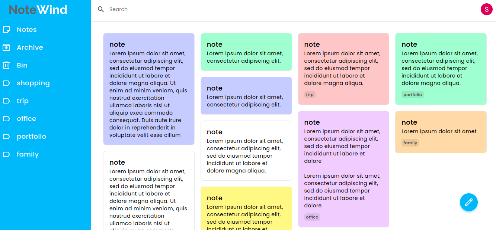

# NoteWind

NoteWind is a note-taking app, created with ReactJS and Firebase.

👉 [Live Demo](https://notewind.netlify.app/)

## Key Features

- Sign In / Sign Out

- Toggle Layout / Change note background

- Create, edit, delete, and archive notes

- Sort / search / filter notes

- Pin / Unpin notes

- Add, update, and remove labels

- Fully responsive design

## Screenshot



## Technologies Used

- [ReactJS](https://reactjs.org/)

- [Firebase](https://firebase.google.com/)

- [Tailwind CSS](https://tailwindcss.com/)

## Getting Started

### Project setup

```bash
# clone repo
git clone https://github.com/sneharatnani/notewind.git

# changing directory
cd notewind

# installing dependencies
npm install

# starting server
npm start
```

### Firebase setup

- Create a Firebase project
  - Go to Firebase → Get Started → Add project
- Register your app
  - Go to Project overview → Choose </> (Web App)
- Enable Google Sign in
  - Go to Authentication → Get Started → Sign-in method → Enable Google
- Enable Firestore
  - Go to Firestore Database → Create database
- Setup project
  - Go to Project settings → General → Your apps → SDK setup and configuration → Config
  - Create a .env.local file in project's root directory
  - Paste code below and provide your keys found in Config

```bash
REACT_APP_API_KEY={apiKey}
REACT_APP_AUTH_DOMAIN={authDomain}
REACT_APP_PROJECT_ID={projectId}
REACT_APP_STORAGE_BUCKET={storageBucket}
REACT_APP_MESSAGING_SENDER_ID={senderId}
REACT_APP_APP_ID={appId}
```
