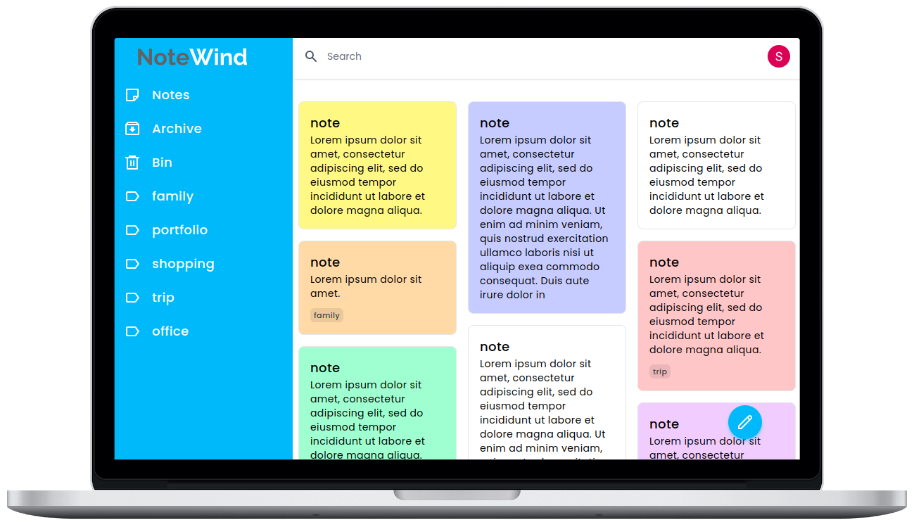

# NoteWind



NoteWind is a note-taking application, created with ReactJS and Firebase.

👉 **[Live Demo](https://notewind.netlify.app/)**

## Key Features

- User Authentication
- Create, edit, delete, and archive notes
- Search notes
- Filter notes by label name
- Pin and Unpin notes
- Add, update, and delete multiple labels
- Toggle Layout
- Change note background
- Fully responsive design

## Technologies Used

- [ReactJS](https://reactjs.org/)
- [Firebase](https://firebase.google.com/)
- [Tailwind CSS](https://tailwindcss.com/)
- [Jest](https://jestjs.io/)
- [Testing Library](https://testing-library.com/)

## Getting Started

### Project setup

```bash
# clone repo
git clone https://github.com/sneharatnani/notewind.git

# changing directory
cd notewind

# installing dependencies
npm install
```

### Firebase Setup

1. Create a Firebase project:
   - Go to Firebase → Get Started → Add project
2. Register your app:
   - Go to Project overview → Choose </> (Web App)
3. Enable Google Authentication:
   - Go to Authentication → Get Started → Sign-in method → Enable Google
4. Enable Firestore:
   - Go to Firestore Database → Create database
5. Create .env File:
   - Create a .env file in project's root
   - Go to Project settings → General → Your apps → SDK setup and configuration → Config
   - Paste code below in .env and provide your keys found in Config

```bash
REACT_APP_API_KEY={apiKey}
REACT_APP_AUTH_DOMAIN={authDomain}
REACT_APP_PROJECT_ID={projectId}
REACT_APP_STORAGE_BUCKET={storageBucket}
REACT_APP_MESSAGING_SENDER_ID={senderId}
REACT_APP_APP_ID={appId}
```

### Start the application

```bash
# starting the server
npm start

# testing with Jest
npm run test
```

## License

Notewind is [MIT licensed](./LICENSE).
